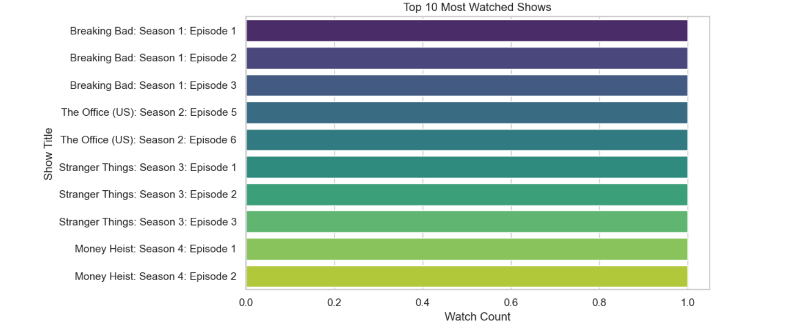
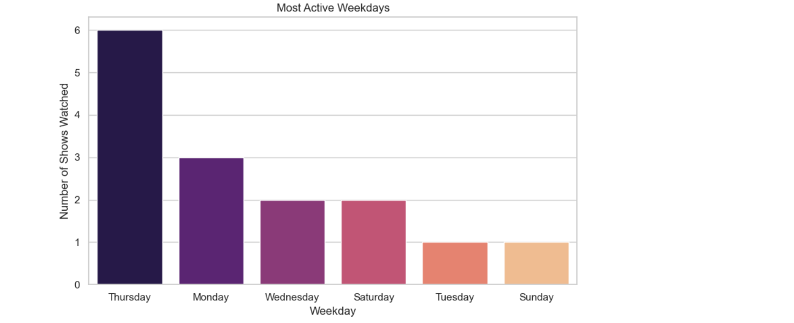

# 📊 Netflix Viewing Pattern Analysis

Analyze your personal Netflix watch history using Python, Pandas, Seaborn, and Jupyter Notebook to discover trends in content consumption.

---

## ✅ Project Overview

This project uncovers patterns in your Netflix viewing history — such as most-watched shows, total watch time, and active viewing days — using data visualization and time-based analysis.

---

## 🧪 Tech Stack

- Python 3  
- Jupyter Notebook  
- Pandas  
- Seaborn  
- Matplotlib  

---

## 📂 Folder Structure

```
Netflix-Viewing-Pattern-Analysis/
├── data/
│   └── NetflixViewingHistory.csv
├── images/
│   ├── screenshot1_loaded_csv.png
│   ├── screenshot2_top_shows.png
│   └── screenshot3_weekdays.png
├── notebook/
│   └── netflix_analysis.ipynb
├── requirements.txt
└── README.md
```

---

## 📸 Project Screenshots

### 🟢 1. Loaded Netflix CSV  
Shows the cleaned Netflix viewing history with extra time-based columns.


---

### 🎬 2. Top 10 Most Watched Shows  
Bar chart showing which shows were watched most frequently.



---

### 📅 3. Most Active Viewing Weekdays  
Visual analysis of viewing frequency by weekday.



---

## 📓 Notebook Location

The entire analysis is performed in this Jupyter Notebook:

```
notebook/netflix_analysis.ipynb
```

Open it using Jupyter Notebook or Jupyter Lab.

---

## ⚙️ How to Run

1. Clone this repository  
2. Install the dependencies:
   ```bash
   pip install -r requirements.txt
   ```
3. Run Jupyter Notebook:
   ```bash
   jupyter notebook
   ```
4. Open the file `notebook/netflix_analysis.ipynb` and run the cells

---

## 📌 Key Insights

- Total watch time in hours and minutes
- Most-watched shows from your history
- Peak watching days (e.g. Thursday, Saturday)
- Monthly watch trends
- Visual insights into viewing habits

---

## 👤 Author

Jami Bhargav Venkat
GitHub: [@bhargavjami](https://github.com/bhargavjami)
